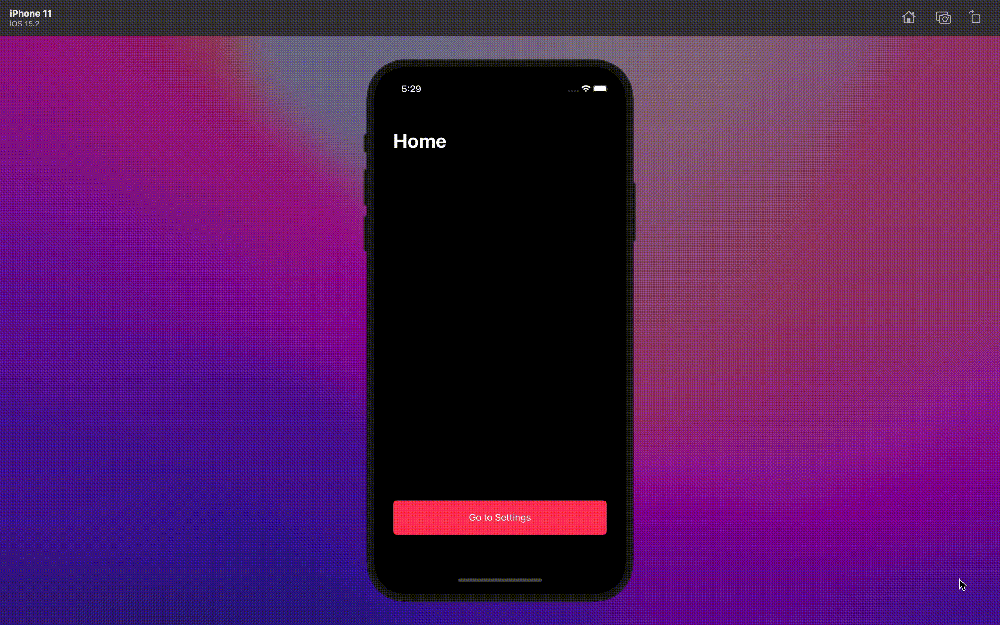
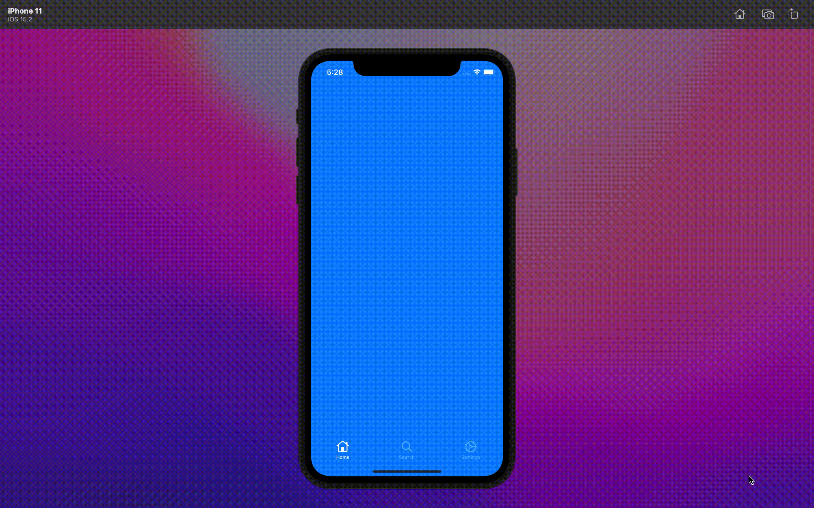
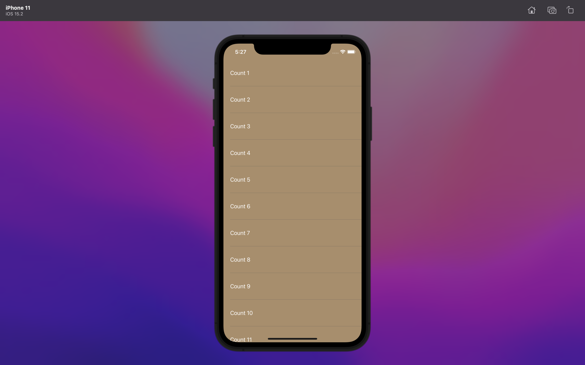
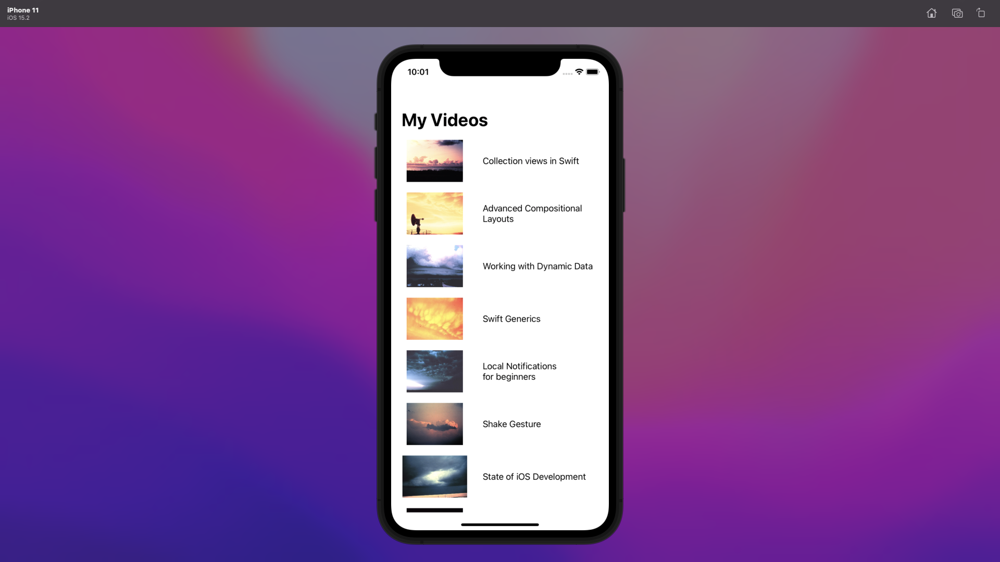
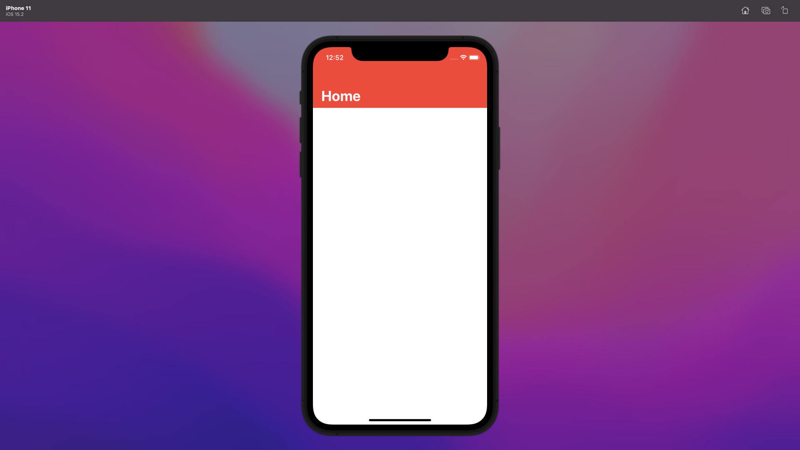

# Programmatic UIKit 📲

Composing reusable UIKit code 👨🏽‍💻 programmatically one at a time without storyboards.

## Tech Stack
- Swift 
- UIKit

## Project-based Topics

- **NavigationControllers**: contains code snippets on how to set a **Navigation Controller** as the main navigation to present multiple screens programmatically without the use of a storyboard.

- **TabBarControllers**: contains code snippets on how to set a **Tab Bar Controller** as the main navigation to present multiple screens programmatically without the use of a storyboard.

- **TabBarAndNavigationController**: contains code snippets on how to handle both **Tab Bar** and **Navigation Controllers** within an application programmatically without the use of a storyboard.

- **TableView**: contains code snippets of how to display a table view component with a list of table view cells programmatically without the use of a storyboard.

- **TableViewWithCustomCell**: code snippets for creating a table view with a custom cell programmatically.

- **CustomNavigationBar**: code snippets for creating a custom navigation bar in UIKit using code only. This code snippet takes care of issues such as changing the status bar text color, navigation background and foreground color.

- **MVVMCPattern**: a widely use folder structure pattern for most iOS projects.

**✍️ Todo**
- an example of how to combine both NavigationController and TabBarController together. ✅
- an example of using table views. ✅
- an example of using table view(custom cell) ✅
- an example of using collection views.
- an example of using auto layouts.
- an example of using MVVMC architecture. ✅